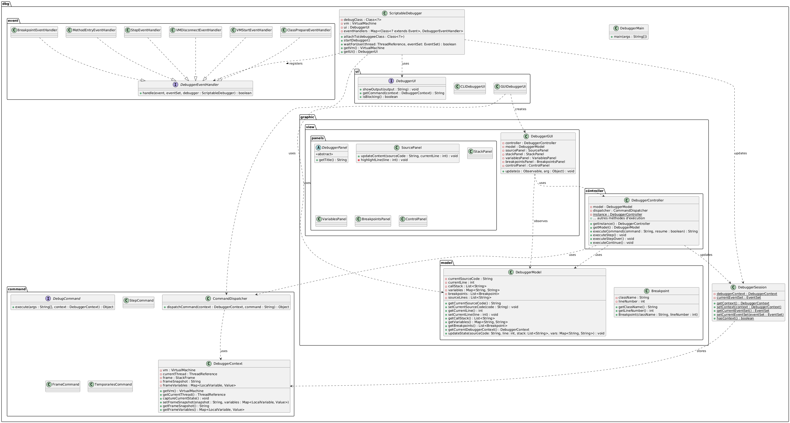

# Debugger JDI avec Time Travelling
***THOMAS Antoine*** - ***LE GOFF Tanguy***

**Note :** Ce fichier `README.md` concerne uniquement les commandes en CLI, en GUI et le "time travel". 
Pour consulter le code sur l'interface graphique (GUI) et les commandes CLI, veuillez consulter la branche `master`.
Pour consulter le code sur la partie "time travel" et les commandes CLI, veuillez consulter la branche `feat/time-travel`.

## Installation et Prérequis
- Java 21+
- Gradle
- IDE (IntelliJ recommandé)

## build

```bash
gradle build
gradle run
```

## Tests

Il y a 7 tests d'intégrations actuellement.
Ils sont automatisés et servent à vérifier le bon fonctionnement du débogueur en mode CLI.

## Exécution

run `Main` dans la classe JDISimpleDebugger pour la partie CLI.

run `DebuggerMain` dans la classe DebuggerMain pour la partie GUI.


**Attention** : Il faut en paramètre d'emplacement d'exécution `jdi-debugger-impl\out\production\classes`

## Commandes disponibles

### Commandes de base
- `step` : Exécute l'instruction suivante en entrant dans les méthodes
- `step-over` : Exécute l'instruction suivante sans entrer dans les méthodes
- `continue` : Continue l'exécution jusqu'au prochain point d'arrêt

### Navigation et inspection
- `frame` : Affiche la frame courante
- `temporaries` : Liste les variables temporaires avec leurs valeurs
- `stack` : Affiche la pile d'appels de méthodes
- `receiver` : Affiche le receveur de la méthode courante
- `sender` : Affiche l'objet appelant la méthode courante
- `method` : Affiche la méthode en cours d'exécution
- `arguments` : Liste les arguments de la méthode
- `print-var <nom>` : Affiche la valeur d'une variable

### Gestion des points d'arrêt
- `break <fichier> <ligne>` : Place un point d'arrêt
- `breakpoints` : Liste les points d'arrêt actifs
- `break-once <fichier> <ligne>` : Point d'arrêt à usage unique
- `break-on-count <fichier> <ligne> <nombre>` : Point d'arrêt activé après N passages
- `break-before-method-call <méthode>` : Point d'arrêt avant l'appel d'une méthode

### Version Time Travelling
- `step-back` : Revient à l'état précédent
- `step-back <N>` : Revient de N états en arrière

# Architecture du débogueur

## Vue d'ensemble -- Version Time Travelling

Le débogueur est organisé autour de plusieurs composants clés :

### Core
- `ScriptableDebugger` : Composant principal gérant la VM et les événements JDI
- `DebuggerSession` : Gère l'état global de la session de débogage
- `DebuggerContext` : Maintient le contexte d'exécution et l'historique

### Gestion des commandes
- `CommandDispatcher` : Router pour les commandes utilisateur
- `DebugCommand` : Interface pour toutes les commandes
- Package `command` : Implémentations des commandes spécifiques

### Gestion des événements
- Package `event` : Handlers pour les différents événements JDI
- `DebuggerEventHandler` : Interface commune pour tous les handlers

### Time Travelling
- `ExecutionState` : Capture un état d'exécution complet
- Mécanisme de restauration via redémarrage de VM
- Historique des états dans `DebuggerContext`

## Vue D'ensemble -- Version GUI

Certains points d'architecture de la vue d'ensemble de la version time travel sont partagés.

Architecture globale du projet (voir directement l'image si problème de lisibilité) : 


